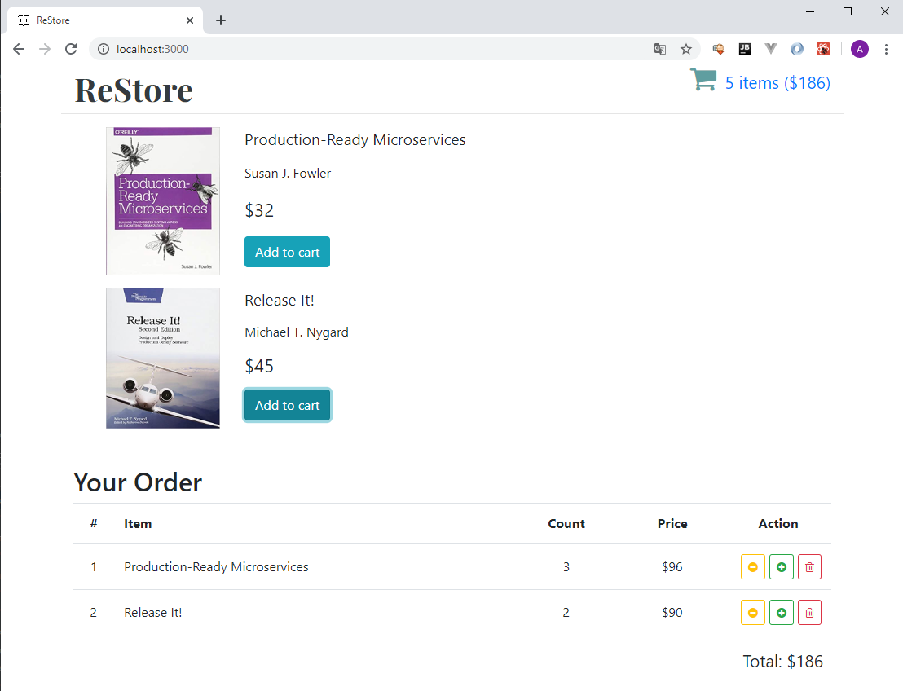

# ReStore
Третье react-приложение написанное в рамках учебного курса ["React + Redux - Профессиональная Разработка"](https://www.udemy.com/course/pro-react-redux/).

Представляет из себя интерфейс онлайн-магазина по продаже книг. Является примером приложения, использующего связку библиотек React + Redux.

# Example

